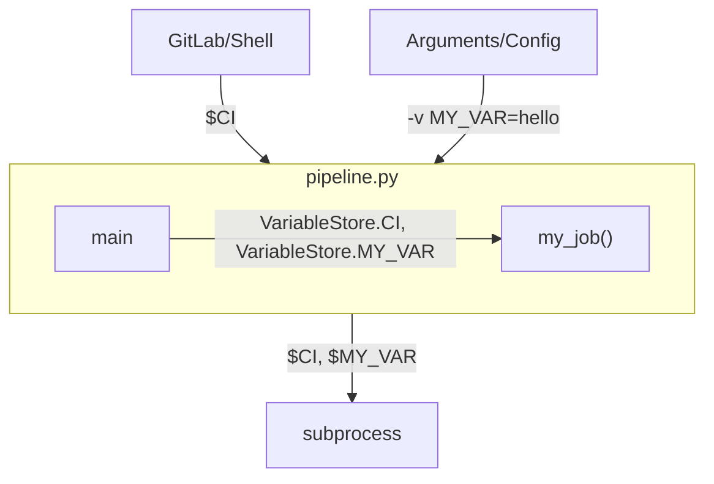

# Variables
The class `Variable` is the *spycilab* answer to GitLab CI variables.
Variables have to be declared as member of a `VariableStore`.
```python
variables = VariableStore()
variables.my_variable = Variable(default="some value")
```
generates
```yaml
variables:
  my_variable: "some value"
```

Each store automatically defines the (most relevant) predefined CI variables:
```python
variables = VariableStore()
variables.CI_COMMIT_BRANCH
variables.CI_JOB_NAME
...
```

## Internal and Environment Variables

Variables from the VariableStore are reflected in the environment (shell), this means the following:
- input: environment variable set by GitLab are applied to the VariableStore
- forwarding: any sub process created by the pipeline script can access variables from the VariableStore through the environment

These features can be turned off with commandline arguments `--no-input-env` and `--no-forward-env`.

## Working with Variable Values
The value of a variable can be accessed through the `.value` member:
```python
print(variables.my_variable.value) # prints default "some value" if variable was not set by user
```
Conversion to string and bool is built-in, so:
```python
variables.my_variable = Variable(default_value="abc")
...
print(variables.my_variable) # "abc"
if variables.my_variable:
    print("my_variable is not empty")
```
Be careful though when using variables in a job, as variable values will only ever be set through the `Pipeline().main()` method.
This is how to **NOT** do it:
```python
variables = VariableStore()
variables.my_variable = Variable(default="some value")
def print_value(v):
    print(v)
    
my_var_value = variables.my_variable.value
jobs.my_job = Job("My Job", JobConfig(work=lambda: print_value(my_var_value))) # this will always print the default "some value", no matter what the variable was actually set to by the user
```
This is better:
```python
...
def print_value(v):
    print(v.value)
    
jobs.my_job = Job("My Job", JobConfig(work=lambda: print_value(variables.my_var)))
```
Variables can be compared directly with a string or another variable.
```python
variables.var_a = Variable()
variables.var_b = Variable()

...
def my_job_work():
   if variables.var_a == "lit" and variables.var_a == variables.var_b : 
       print("var_a and var_b are 'lit'")

```

## Boolean Variable
There is a convenient `Variable` derivative `BoolVariable` that automatically defines a `yes` and `no` option.
A default value is required (`True`/`False`).
```python
variables.bool_var = BoolVariable(default_value=True)
...
if variables.bool_var:
    print("Variable is set to True ('yes')")
```
Please note that the `value` member of a BoolVariable is still a string, so:
```python
variables.bool_var = BoolVariable(default_value=False)
if variables.bool_var.value:
    print("Always true, if variable was set to some value (not the empty string)")
```

